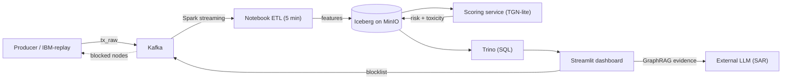

# AML Graph Platform

A real-time anti-money-laundering (AML) system that models inter-account banking
activity as a dynamic transaction graph and assigns calibrated risk to both
individual transfers and account holders. The platform couples a streaming
graph neural network with a lakehouse data backbone and a human-in-the-loop
investigation interface, closing the loop between machine inference and
analyst action.

## Overview

Transactions are ingested as directed edges over an evolving account graph.
A feature pipeline derives node- and edge-level signals, a temporal graph
network scores each event, and a Streamlit console lets an officer triage,
explain, and block suspicious accounts. Crucially, blocking feeds back into the
graph: edges incident to blocked accounts are excluded, allowing contaminated
but legitimate accounts to "recover" their risk over subsequent cycles.

## Methodology

The scoring engine is **TGN-lite**, a streaming temporal graph network. Each
node maintains a memory state $$ h_v $$ updated by a GRU from incoming edge
messages under a delayed-message training scheme. An edge head predicts a
per-transaction risk probability $$ p $$, while a node head predicts account
**toxicity** — the probability that an account behaves as a dropper or mule.
Outputs are temperature-scaled (calibration parameter $$ node\_temp $$) so that
toxicity propagates across the graph rather than saturating at $$ 1.0 $$.
Serving is exactly-once via an anti-join on previously scored transaction
identifiers, with per-node memory that grows as new accounts appear.

The feature contract is fixed: eleven node features and three edge features,
with a SQL definition that reproduces the live ETL exactly and fixed
normalization statistics persisted alongside the model artifact. Models are
trained on a hardened synthetic generator (hub/mule topologies, amount and age
overlap, contamination, four laundering typologies) and can be retrained on the
real **IBM AML (AMLWorld)** dataset.

## Architecture

The lakehouse layer combines MinIO (object store), Apache Iceberg tables, a Hive
Metastore catalog, Trino (SQL access), and Spark. Transaction state advances
through a `PENDING → FEATURES_READY → SCORED` machine, plus a `BLOCKED` state
for feedback edges. Two execution paths are supported and must not be mixed:

- **Live**: producer → Kafka → notebook ingest + 5-minute ETL → scoring loop → dashboard (via Trino).
- **Offline/batch**: seed → feature pipeline → scoring over Parquet/Iceberg, without Kafka.

Investigations are explained by an LLM operating over the local graph
(GraphRAG), producing SAR-style narratives that distinguish hubs from mules and
avoid guilt-by-association.

## Capabilities

- Streaming, calibrated, exactly-once graph scoring with growable memory.
- Analyst console: ego-graph exploration, in/out flow analysis, blocking, live
  monitoring, and recall/health verification against ground truth.
- Blocklist feedback loop enabling legitimate-account recovery.
- Real-data path mapping IBM AMLWorld into the same schema for retraining.

## Status

The offline (Parquet/DuckDB) path is verified. The Spark/Kafka/Iceberg live
path is implemented but requires on-stand testing under Docker. Known gaps
include chain/cluster blocking, time-series verification, gradual memory decay
after blocking, and horizontal scale-out (e.g. Flink keyed state) for very high
throughput.
