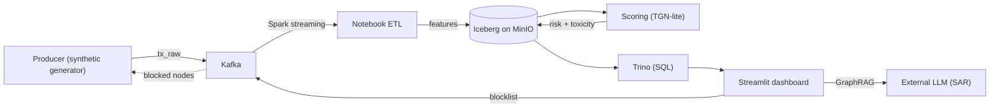

# AML Graph Platform

Real-time anti-money-laundering on a graph of bank transactions. Transfers
stream in as edges between accounts, a streaming graph neural network scores
each transfer and each account, and an analyst console surfaces the riskiest
accounts, blocks them, and drafts a SAR-style explanation. Blocking feeds back
into the graph, so accounts wrongly dragged up by a bad neighbor recover over
the next few cycles.

## Features

- Streaming graph scoring with **TGN-lite**: per-account memory updated by a GRU
  from incoming transfers; one head scores transaction risk, another scores
  account toxicity (dropper/mule probability).
- Calibrated outputs (temperature scaling) so risk propagates instead of
  pinning at 1.0.
- Stateless windowed scoring: each cycle replays a rolling 30-day window from
  zeroed memory, so live scores match training; transactions written exactly-once.
- Human-in-the-loop console: ego-graph exploration, in/out flow analysis, one
  click block, live monitoring, and recall against ground truth.
- Blocklist feedback loop that lets contaminated legitimate accounts recover;
  block a single account or a whole fraud chain at once (legit hubs excluded).
- LLM explanations over the local subgraph (GraphRAG) that separate hubs from
  mules and avoid guilt-by-association.

## Architecture



The data layer is a lakehouse: MinIO for storage, Iceberg tables, a Hive
Metastore catalog, Trino for SQL, and Spark for the ETL. Transactions move
through `PENDING → FEATURES_READY → SCORED`, with `BLOCKED` reserved for
feedback edges. Two paths exist and must not be mixed:

- **Live** — producer → Kafka → notebook ETL → scoring loop → dashboard.
- **Offline** — seed → feature pipeline → scoring over Parquet/Iceberg, no Kafka.

## Quickstart

```bash
cd infra
docker compose down -v
docker compose --profile core --profile streaming up -d --build
# Jupyter http://localhost:8888 (token: aml) -> src/etl/streaming_etl.ipynb
#   run cells in order: 1 -> 1b (reset) -> 2 (DDL) -> 3 -> 3b -> 4 (ETL loop)
docker compose --profile scoring up -d --build scoring
# dashboard: http://localhost:8501
```

For a visible block→recovery demo, start the producer with `--demo-contamination`
(a few legit accounts get structured deposits; blocking the fraud around them
heals them). For an offline demo without the stack, point the dashboard at the
shipped `data/scored_*.parquet` with `DASH_SOURCE=parquet`.

## Layout

| Path | Contents |
|------|----------|
| `infra/` | docker-compose, Trino, Hive, Spark, PySpark |
| `src/ingest/` | Kafka producer (synthetic generator) |
| `src/etl/`, `src/features/` | streaming and batch feature pipelines |
| `src/ml/` | model, training, scoring, artifacts |
| `src/ui/` | Streamlit app, graph queries, LLM explainer |
| `docs/` | architecture notes |

Models train on the synthetic generator (`producer.py --dump-parquet`, the same
distribution served live) covering four laundering typologies, with ground-truth
labels for evaluation.

## Status

Both paths score with near-perfect ranking on held-out data; the live path is
validated by replaying the streaming scorer offline. Open items: a time-series
view of account health around a block and horizontal scale-out (e.g. Flink
keyed state) for very high throughput.
